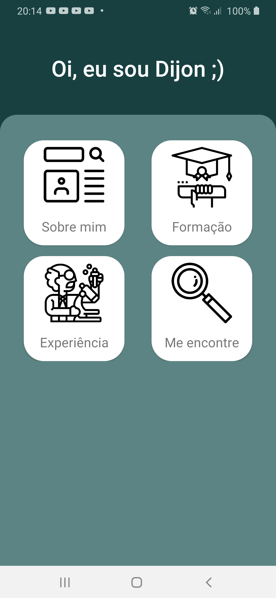
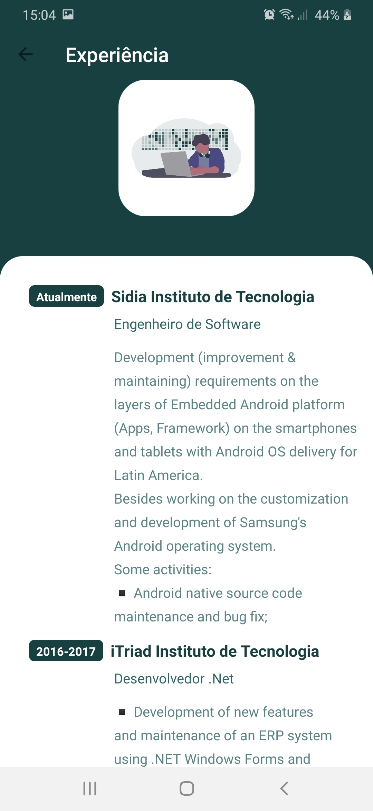
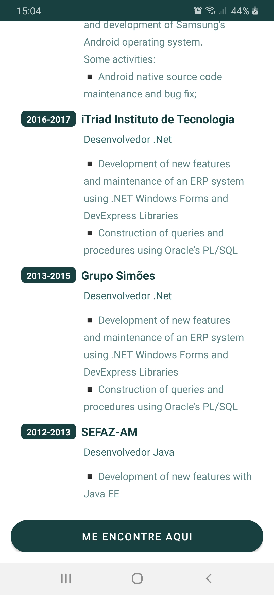
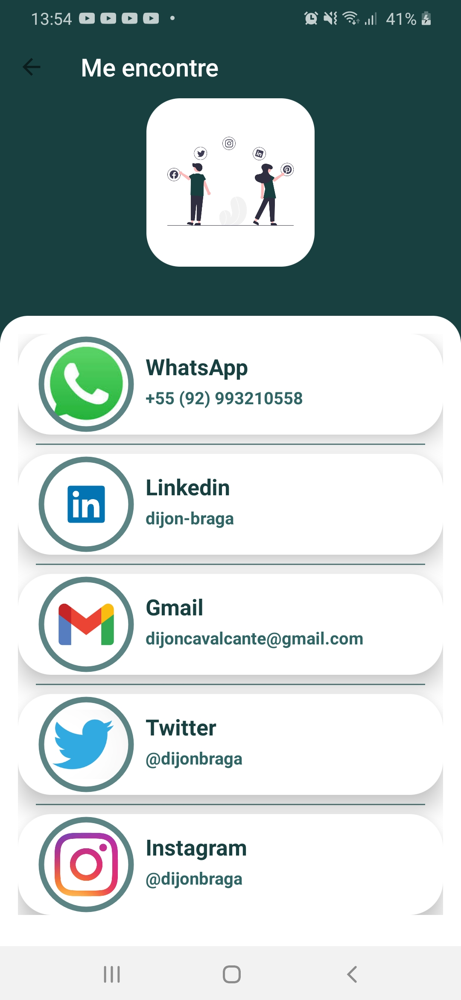

# Layout

   
 

# Welcome About Me App
The purpose of this app is to show a little about my professional experience.

# Project
This project make use some technologies requested by market to help in some scenarios that simulate day to day of a android developer  
My reason for creating the app was learning about the Kotlin language that I have been working hard to learn. 
I also had the opportunity to learn more about creating layouts using ConstraintsLayouts. 
The application aims to demonstrate my resume in the format of an application, facilitating the way to contact me through social networks, email, Whatsapp and other means.

# Technologies
This project use the follow technologies and tools:
- [ViewBinding](https://developer.android.com/topic/libraries/view-binding) - Is a feature that allows you to more easily write code that interacts with views.
- [ConstraintLayout](https://developer.android.com/training/constraint-layout) - ConstraintLayout allows you to create large and complex layouts with a flat view hierarchy
- [MDC](https://material.io/components?platform=android) - Material Components are interactive building blocks for creating a user interface.
- [Cardview](https://developer.android.com/guide/topics/ui/layout/cardview?hl=pt-br) - A FrameLayout with a rounded corner background and shadow.  
- [CircleIndicator](https://github.com/ongakuer/CircleIndicator/blob/master/README.md) - A lightweight indicator like in nexus 5 launcher.
- [ViewPager2](https://developer.android.com/jetpack/androidx/releases/viewpager2) - Swipe views allow you to navigate between sibling screens, such as tabs, with a horizontal finger gesture, or swipe.

# Notice
- The information is static.
- There was no need to create a local database.